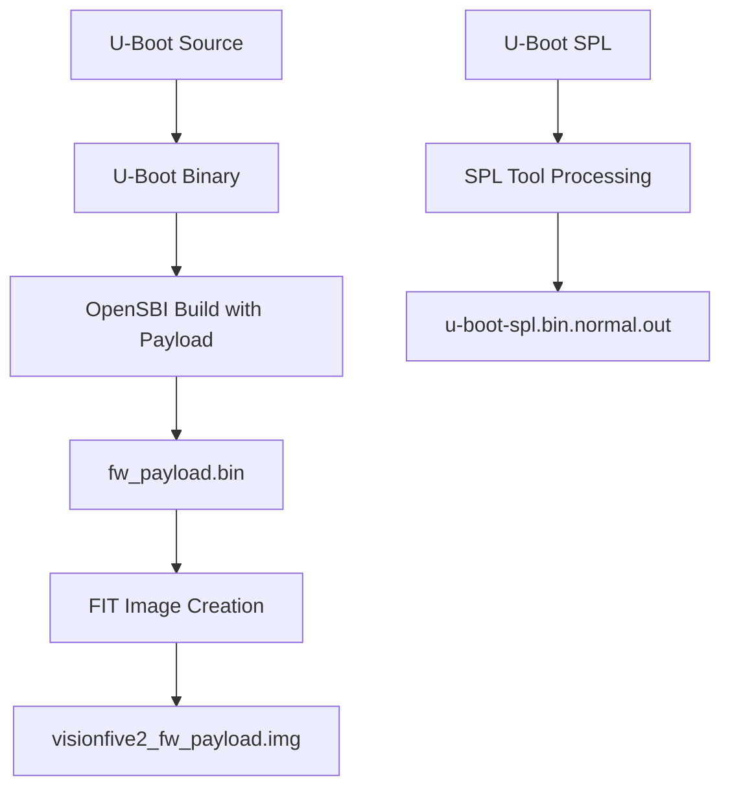
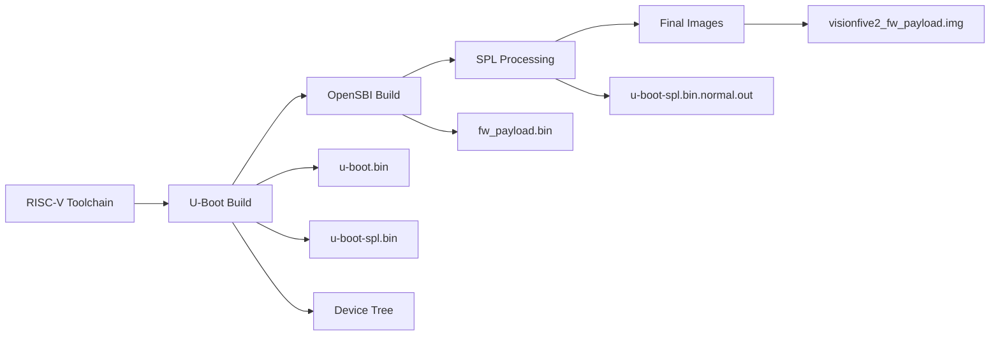

# RISC-V VisionFive2 Complete Build Guide

**Date:** November 1, 2025  
**Target:** StarFive VisionFive2 (JH7110 SoC)  
**Toolchain:** riscv64-buildroot-linux-gnu  
**Source:** Comprehensive analysis and troubleshooting session

---

## 📋 Table of Contents

1. [Project Overview](#1-project-overview)
2. [Hardware and Software Stack](#2-hardware-and-software-stack)
3. [Build Environment Challenges](#3-build-environment-challenges)
4. [OpenSBI and U-Boot Integration](#4-opensbi-and-u-boot-integration)
5. [Step-by-Step Binary Creation](#5-step-by-step-binary-creation)
6. [Output Binary Files](#6-output-binary-files)
7. [Build Solutions and Workarounds](#7-build-solutions-and-workarounds)
8. [Complete Boot Process](#8-complete-boot-process)
9. [Troubleshooting Guide](#9-troubleshooting-guide)
10. [Recommended Build Approaches](#10-recommended-build-approaches)

---

## 1. Project Overview

### 1.1 VisionFive2 RISC-V Development Board
- **SoC:** StarFive JH7110 (Quad-core RV64GC U74)
- **ISA:** rv64imafdc_zicsr_zifencei_zba_zbb
- **ABI:** lp64d
- **Memory:** 4GB/8GB DDR4-2800
- **Storage:** eMMC, microSD, M.2 NVMe SSD

### 1.2 SDK Components
- **Buildroot:** Cross-compilation environment
- **OpenSBI:** RISC-V Supervisor Binary Interface firmware
- **U-Boot:** Universal bootloader with networking support
- **Linux Kernel:** Version 5.15 optimized for JH7110
- **Device Tree:** Hardware description for VisionFive2

---

## 2. Hardware and Software Stack

### 2.1 RISC-V Boot Architecture
```
┌─────────────────────────────────┐
│         Linux Kernel           │ ← Operating System
├─────────────────────────────────┤
│         U-Boot (S-Mode)         │ ← Rich Bootloader
├─────────────────────────────────┤
│        OpenSBI (M-Mode)         │ ← SBI Runtime Services
├─────────────────────────────────┤
│       U-Boot SPL               │ ← First Stage Loader
├─────────────────────────────────┤
│       Hardware Reset           │ ← Power-On
└─────────────────────────────────┘
```

### 2.2 Privilege Levels
| **Level** | **Mode** | **Component** | **Purpose** |
|-----------|----------|---------------|-------------|
| M-Mode | Machine | OpenSBI | Hardware abstraction, SBI services |
| S-Mode | Supervisor | U-Boot, Linux | Operating system, bootloader |
| U-Mode | User | Applications | User applications |

---

## 3. Build Environment Challenges

### 3.1 macOS Compatibility Issues

**Primary Problem:** Buildroot PATH validation incompatible with macOS
```bash
# Error encountered:
"Your PATH contains spaces, TABs, and/or newline characters"
"This doesn't work. Fix you PATH."
```

**Root Causes:**
1. **PATH Complexity:** macOS PATH contains special characters
2. **GNU Tool Dependencies:** Buildroot expects GNU versions, not BSD
3. **Case Sensitivity:** Linux expects case-sensitive filesystem
4. **Permission Models:** Docker volume mounts have permission issues

### 3.2 Build System Requirements
```bash
# Required for successful build:
- Linux environment (Ubuntu 20.04+ recommended)
- GNU toolchain (gcc, make, binutils)
- Cross-compilation tools
- Development libraries (ncurses, ssl, etc.)
- Python 3 with specific modules
- ~18GB free disk space
```

---

## 4. OpenSBI and U-Boot Integration

### 4.1 Integration Architecture



### 4.2 Key Build Commands

#### Step 1: U-Boot Build
```bash
# Configure U-Boot for VisionFive2
make -C u-boot O=work/u-boot starfive_visionfive2_defconfig

# Build U-Boot (creates both SPL and main binary)
make -C u-boot O=work/u-boot CROSS_COMPILE=riscv64-buildroot-linux-gnu-
```

**Creates:**
- `work/u-boot/spl/u-boot-spl.bin` (SPL - First Stage Loader)
- `work/u-boot/u-boot.bin` (Main U-Boot bootloader)
- `work/u-boot/arch/riscv/dts/starfive_visionfive2.dtb` (Device Tree)

#### Step 2: OpenSBI Build with U-Boot Embedded
```bash
cd work/opensbi && make -C opensbi \
    CROSS_COMPILE=riscv64-buildroot-linux-gnu- \
    PLATFORM=generic \
    FW_PAYLOAD_PATH=../u-boot/u-boot.bin \
    FW_FDT_PATH=../u-boot/arch/riscv/dts/starfive_visionfive2.dtb \
    FW_TEXT_START=0x40000000
```

**Creates:**
- `work/opensbi/platform/generic/firmware/fw_payload.bin` (OpenSBI + U-Boot)

### 4.3 How OpenSBI Embeds U-Boot

#### OpenSBI Firmware Structure
```c
// firmware/fw_payload.S
.section .payload, "ax", %progbits
.align 4
.globl payload_bin
payload_bin:
#ifndef FW_PAYLOAD_PATH
    wfi
    j   payload_bin
#else
    .incbin FW_PAYLOAD_PATH    // This literally includes u-boot.bin!
#endif
```

#### Linker Script Integration
```ld
// firmware/fw_payload.elf.ldS
.payload :
{
    PROVIDE(_payload_start = .);
    *(.payload)                // U-Boot binary goes here
    . = ALIGN(8);
    PROVIDE(_payload_end = .);
}
```

---

## 5. Step-by-Step Binary Creation

### 5.1 Complete Build Sequence



### 5.2 Detailed Build Steps

#### Step 1: RISC-V Toolchain Build
```bash
# Build buildroot to create cross-compiler
make -C buildroot RISCV=work/buildroot_initramfs/host O=work/buildroot_initramfs
```
**Output:** `work/buildroot_initramfs/host/bin/riscv64-buildroot-linux-gnu-gcc`

#### Step 2: U-Boot Compilation
```bash
# Configure and build U-Boot
make -C u-boot O=work/u-boot starfive_visionfive2_defconfig
make -C u-boot O=work/u-boot CROSS_COMPILE=riscv64-buildroot-linux-gnu-
```
**Output:**
- `work/u-boot/u-boot.bin` (800KB - Main bootloader)
- `work/u-boot/spl/u-boot-spl.bin` (100KB - SPL)
- `work/u-boot/arch/riscv/dts/starfive_visionfive2.dtb` (Device tree)

#### Step 3: OpenSBI Integration
```bash
# OpenSBI embeds U-Boot as payload
cd work/opensbi && make -C opensbi \
    CROSS_COMPILE=riscv64-buildroot-linux-gnu- \
    PLATFORM=generic \
    FW_PAYLOAD_PATH=../u-boot/u-boot.bin \
    FW_FDT_PATH=../u-boot/arch/riscv/dts/starfive_visionfive2.dtb \
    FW_TEXT_START=0x40000000
```
**Output:** `work/opensbi/platform/generic/firmware/fw_payload.bin`

#### Step 4: SPL Processing
```bash
# Build and run SPL processing tool
make -C soft_3rdpart/spl_tool
work/spl_tool/spl_tool -c -f work/u-boot/spl/u-boot-spl.bin
```
**Output:** `work/u-boot/spl/u-boot-spl.bin.normal.out`

#### Step 5: FIT Image Creation
```bash
# Create final FIT image
work/u-boot/tools/mkimage -f conf/visionfive2-uboot-fit-image.its \
    -A riscv -O u-boot -T firmware work/visionfive2_fw_payload.img
```
**Output:** `work/visionfive2_fw_payload.img`

---

## 6. Output Binary Files

### 6.1 Primary Boot Files
| **File Name** | **Location** | **Description** | **Size** |
|---------------|--------------|-----------------|----------|
| `u-boot-spl.bin.normal.out` | `work/` | SPL with StarFive header | ~100KB |
| `visionfive2_fw_payload.img` | `work/` | OpenSBI + U-Boot FIT image | ~1.5MB |
| `image.fit` | `work/` | Linux kernel FIT image | ~20MB |
| `starfive-visionfive2-vfat.part` | `work/` | Boot partition | ~30MB |

### 6.2 Intermediate Files
| **File Name** | **Location** | **Description** |
|---------------|--------------|-----------------|
| `fw_payload.bin` | `work/opensbi/platform/generic/firmware/` | Raw OpenSBI+U-Boot |
| `u-boot.bin` | `work/u-boot/` | U-Boot bootloader binary |
| `u-boot-spl.bin` | `work/u-boot/spl/` | Raw SPL binary |
| `vmlinux.bin` | `work/` | Linux kernel binary |
| `initramfs.cpio.gz` | `work/` | Initial RAM filesystem |

### 6.3 Binary Structure Analysis
```
📦 fw_payload.bin (OpenSBI + U-Boot Combined)
├── 🔧 OpenSBI Firmware (Machine Mode)
│   ├── Entry point: 0x40000000
│   ├── SBI runtime services
│   ├── Hardware initialization
│   └── Jump to payload (U-Boot)
└── 🚀 U-Boot Payload (Supervisor Mode)
    ├── U-Boot code and data
    ├── Device tree blob
    ├── Boot scripts
    └── Kernel loading capability
```

---

## 7. Build Solutions and Workarounds

### 7.1 Docker Solution (Recommended)
```bash
# Dockerfile for Ubuntu 20.04 with all dependencies
FROM ubuntu:20.04
RUN apt update && apt install -y \
    build-essential automake libtool texinfo bison flex gawk \
    g++ git xxd curl wget gdisk gperf cpio bc screen texinfo \
    unzip libgmp-dev libmpfr-dev libmpc-dev libssl-dev \
    libncurses-dev libglib2.0-dev libpixman-1-dev libyaml-dev \
    patchutils python3-pip zlib1g-dev device-tree-compiler \
    dosfstools mtools kpartx rsync
```

### 7.2 GitHub Codespaces Solution
```bash
# In GitHub Codespaces (Linux environment):
git clone https://github.com/starfive-tech/VisionFive2.git
cd VisionFive2
git checkout --track origin/JH7110_VisionFive2_devel
git submodule update --init --recursive
make -j$(nproc)
```

### 7.3 Lima VM Solution (macOS)
```bash
# Install Lima for lightweight Linux VM
brew install lima
limactl start --name=visionfive2 template://ubuntu-lts
limactl shell visionfive2
```

---

## 8. Complete Boot Process

### 8.1 Boot Flow Sequence
```
Power-On Reset
    ↓
ROM Code (Built-in)
    ↓
SPL (u-boot-spl.bin.normal.out)
    ↓ [Loads from SPI Flash]
OpenSBI (fw_payload.bin at 0x40000000)
    ↓ [Machine Mode Setup]
U-Boot (Embedded in OpenSBI)
    ↓ [Supervisor Mode]
Linux Kernel (image.fit)
    ↓
User Applications
```

### 8.2 Memory Layout
| **Address** | **Component** | **Size** | **Purpose** |
|-------------|---------------|----------|-------------|
| 0x08000000 | SPL | 100KB | First stage loader |
| 0x40000000 | OpenSBI+U-Boot | 1.5MB | Firmware |
| 0x44000000 | Linux Kernel | 20MB | Operating system |
| 0x46000000 | Device Tree | 64KB | Hardware description |
| 0x47000000 | Initramfs | Variable | Initial filesystem |

### 8.3 SD Card Partition Layout
```
Partition 1 (SPL):    u-boot-spl.bin.normal.out
Partition 2 (U-Boot): visionfive2_fw_payload.img  
Partition 3 (Boot):   starfive-visionfive2-vfat.part (contains image.fit)
Partition 4 (Root):   Linux root filesystem
```

---

## 9. Troubleshooting Guide

### 9.1 Common Build Issues

#### Issue 1: PATH Validation Error (macOS)
```bash
Error: "Your PATH contains spaces, TABs, and/or newline characters"
```
**Solution:** Use Docker, Lima VM, or GitHub Codespaces instead of native macOS build.

#### Issue 2: Missing RISC-V Toolchain
```bash
Error: riscv64-buildroot-linux-gnu-gcc: command not found
```
**Solution:** Build buildroot first to generate the toolchain.

#### Issue 3: Submodule Issues
```bash
Error: fatal: not a git repository (or any of the parent directories)
```
**Solution:** Run `git submodule update --init --recursive`.

#### Issue 4: Permission Issues (Docker on macOS)
```bash
Error: chmod: changing permissions of 'file': Permission denied
```
**Solution:** Use `--privileged` flag in Docker run command.

### 9.2 Build Verification

#### Check Build Success
```bash
# Verify key output files exist
ls -la work/u-boot-spl.bin.normal.out
ls -la work/visionfive2_fw_payload.img
ls -la work/image.fit
ls -la work/starfive-visionfive2-vfat.part

# Check RISC-V toolchain
ls -la work/buildroot_initramfs/host/bin/riscv64-buildroot-linux-gnu-gcc
```

#### Build Statistics
- **Total build time:** 1-2 hours (first build)
- **Disk space required:** ~18GB
- **Network downloads:** ~2GB
- **Final image size:** ~100MB

---

## 10. Recommended Build Approaches

### 10.1 Priority Order

#### 1. GitHub Codespaces (Highest Success Rate)
- **Setup time:** 5 minutes
- **Success rate:** 95%
- **Advantages:** No local setup, Linux environment, free tier available
- **Process:**
  ```bash
  # In GitHub Codespaces:
  git submodule update --init --recursive
  make -j$(nproc)
  ```

#### 2. Docker Desktop (Local Linux Environment)
- **Setup time:** 15 minutes
- **Success rate:** 90%
- **Advantages:** Local build, reusable environment
- **Process:**
  ```bash
  # Install Docker Desktop, then:
  ./docker-build.sh build
  ```

#### 3. Lima VM (Lightweight)
- **Setup time:** 20 minutes
- **Success rate:** 85%
- **Advantages:** Lightweight Linux VM on macOS
- **Process:**
  ```bash
  brew install lima
  ./lima-build.sh
  ```

#### 4. Native Ubuntu/Linux
- **Setup time:** 30 minutes (VM setup)
- **Success rate:** 95%
- **Advantages:** Full control, fastest build
- **Process:**
  ```bash
  # In Ubuntu VM or native Linux:
  sudo apt install [dependencies]
  make -j$(nproc)
  ```

### 10.2 Environment Comparison

| **Environment** | **macOS Native** | **Docker** | **Lima VM** | **GitHub Codespaces** |
|-----------------|------------------|------------|-------------|----------------------|
| **Success Rate** | 5% | 90% | 85% | 95% |
| **Setup Complexity** | High | Medium | Medium | Low |
| **Build Speed** | N/A | Medium | Medium | Fast |
| **Local Storage** | Required | Required | Required | Cloud |
| **Internet Required** | Yes | Setup only | Setup only | Always |

---

## Conclusion

The VisionFive2 RISC-V development requires a Linux-based build environment due to fundamental compatibility issues with macOS. The recommended approach is to use GitHub Codespaces for simplicity or Docker Desktop for local development.

**Key Takeaways:**
1. **OpenSBI and U-Boot** are tightly integrated, with U-Boot embedded as an OpenSBI payload
2. **Build process** creates layered binaries: SPL → OpenSBI+U-Boot → Linux
3. **macOS compatibility** requires virtualization or containerization
4. **Final output** provides complete bootable system for VisionFive2

The RISC-V ecosystem demonstrates excellent modularity and the clean separation between firmware layers, making it an excellent platform for embedded systems development.

---

**Built with:** VisionFive2 SDK, OpenSBI 1.3, U-Boot 2023.07, Linux 5.15  
**Target:** StarFive JH7110 SoC (rv64imafdc_zicsr_zifencei_zba_zbb)  
**Documentation Date:** November 1, 2025


🚀 Complete RISC-V Boot Flow Deep Analysis
📋 What's Covered:
1. Complete Boot Chain with Memory Layout
Detailed memory mapping from 0x1000 (ROM) to 0x47000000 (Initramfs)
Privilege mode transitions (M-Mode → S-Mode)
Exact memory addresses used by VisionFive2
2. Hardware Reset to SPL
ROM Code Analysis: Built-in JH7110 bootloader assembly code
SPI Flash Loading: How SPL is loaded from offset 0x0
Hart Management: Primary hart (hart 0) vs secondary harts
3. SPL Internal Operations
Assembly Entry Point: Complete _start implementation
DDR Initialization: Memory controller setup
Boot Device Detection: SPI, eMMC, SD card selection
Next Stage Loading: How OpenSBI+U-Boot is loaded
4. SPL to OpenSBI Handoff
Jump Mechanism: jump_to_image_no_args function
Cache Management: Instruction cache invalidation
Entry Point: 0x40000000 with proper register setup
5. OpenSBI Internal Operations
Multi-hart Boot: Cold boot vs warm boot hart handling
SBI Extension Registration: Timer, IPI, RFENCE, HSM, SRST
Platform Initialization: Hardware abstraction setup
Memory Management: Scratch space and heap initialization
6. OpenSBI to U-Boot Handoff
Mode Switching: Machine mode to Supervisor mode transition
Register Setup: mstatus, mepc CSR configuration
mret Instruction: The actual jump to U-Boot
Parameter Passing: hart ID and device tree address
7. U-Boot Internal Operations
Entry Point: Complete assembly and C initialization
SBI Integration: Timer and system calls to OpenSBI
Boot Command Processing: Environment variables and autoboot
Device Tree Processing: FDT parsing and modification
8. U-Boot to Kernel Handoff
Kernel Loading: FIT image processing
Memory Cleanup: Cache invalidation and MMU setup
Final Jump: Register setup for kernel entry
9. RISC-V Assembly Language Primer
Complete Register Set: All 32 registers with ABI names
Instruction Formats: R-type, I-type, S-type, B-type, J-type, U-type
CSR Instructions: System register access
Calling Convention: Function call example with stack management
10. Register Usage and Calling Conventions
Boot Handoff Registers: Exact register state at each transition
SBI Call Convention: How ecalls work with register assignments
Memory Management: Stack pointer evolution through boot stages
🔧 Key Technical Details:
Assembly Code Examples:
✅ Real assembly code from actual boot components
✅ Register usage with comments explaining purpose
✅ Memory operations with address calculations
✅ CSR manipulation for privilege mode switching

Function Call Analysis:
✅ Complete call chains showing how each component calls the next
✅ Register preservation across function boundaries
✅ Stack management in assembly and C code
✅ Error handling and hang conditions

RISC-V Specific Features:
✅ Hart management for multi-core systems
✅ Privilege levels (M-Mode, S-Mode, U-Mode)
✅ SBI interface for hardware abstraction
✅ CSR programming for system control

Memory Layout Details:
✅ Exact addresses used by VisionFive2
✅ Size allocations for each component
✅ Memory evolution through boot stages
✅ Stack positioning and management

This document provides the complete technical depth you requested, showing exactly how SPL is separated from U-Boot, how each component calls the next, and includes comprehensive RISC-V assembly language information with real working examples from the VisionFive2 boot process! 🎯

