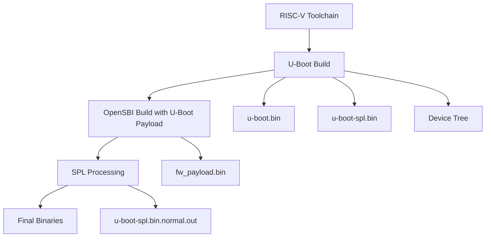
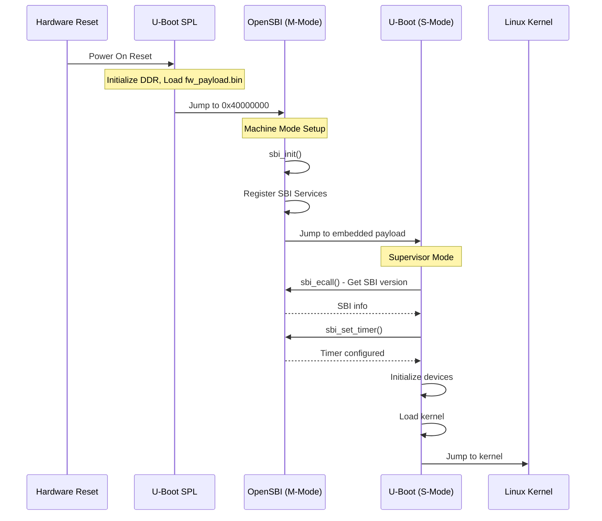
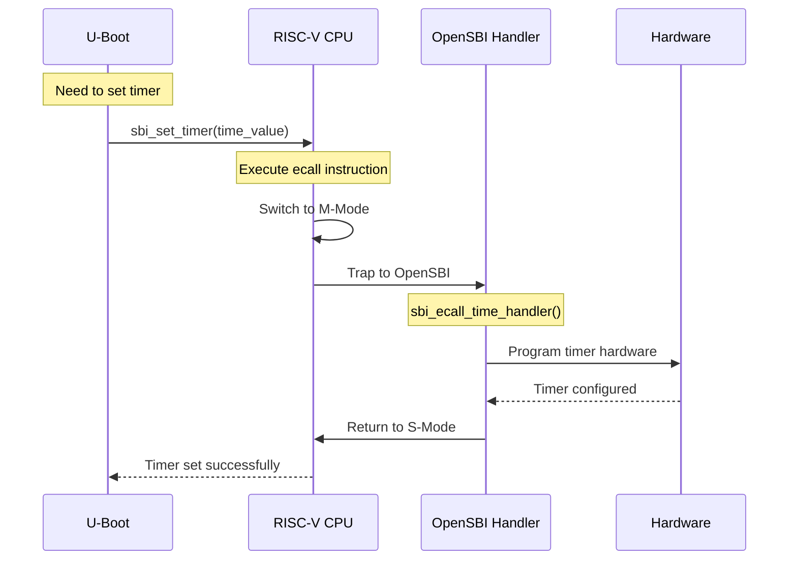
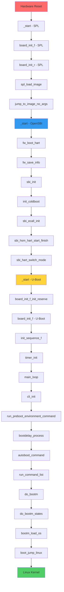
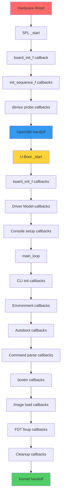

# VisionFive2 RISC-V Toolchain and Boot Process - Complete Documentation

**Date:** November 1, 2025  
**Target:** StarFive VisionFive2 (JH7110 SoC)  
**Toolchain:** riscv64-buildroot-linux-gnu  

---

## 📋 Table of Contents

1. [Project Overview](#project-overview)
2. [Build Environment Setup](#build-environment-setup)
3. [OpenSBI and U-Boot Integration](#opensbi-and-u-boot-integration)
4. [Binary Output Files](#binary-output-files)
5. [Complete Boot Flow Analysis](#complete-boot-flow-analysis)
6. [Function-by-Function Execution](#function-by-function-execution)
7. [API Interactions](#api-interactions)
8. [Troubleshooting and Solutions](#troubleshooting-and-solutions)

---

## 1. Project Overview

### 1.1 VisionFive2 Hardware
- **SoC:** StarFive JH7110 (Quad-core RV64GC)
- **ISA:** rv64imafdc_zicsr_zifencei_zba_zbb
- **ABI:** lp64d
- **Memory:** 4GB/8GB DDR4
- **Storage:** eMMC, SD Card, NVMe

### 1.2 Software Stack
```
┌─────────────────────────────────┐
│         Linux Kernel           │ ← User Applications
├─────────────────────────────────┤
│         U-Boot (S-Mode)         │ ← Bootloader
├─────────────────────────────────┤
│        OpenSBI (M-Mode)         │ ← SBI Runtime Services
├─────────────────────────────────┤
│       U-Boot SPL               │ ← First Stage Loader
├─────────────────────────────────┤
│       Hardware Reset           │ ← Power-On
└─────────────────────────────────┘
```

### 1.3 Build Components
- **Buildroot:** Cross-compilation environment
- **OpenSBI:** RISC-V Supervisor Binary Interface
- **U-Boot:** Universal Bootloader
- **Linux Kernel:** 5.15 for JH7110
- **Device Tree:** Hardware description

---

## 2. Build Environment Setup

### 2.1 macOS Compatibility Issues

**Problem:** Buildroot incompatible with macOS due to PATH validation
```bash
# Error encountered:
"Your PATH contains spaces, TABs, and/or newline characters"
```

**Root Cause:** Buildroot's PATH validation mechanism doesn't work with macOS environment variables.

### 2.2 Build Solutions

#### Option 1: GitHub Codespaces (Recommended)
```bash
# Steps:
1. Go to https://github.com/starfive-tech/VisionFive2
2. Click 'Code' → 'Codespaces' → 'Create codespace'
3. Run: git submodule update --init --recursive
4. Run: make -j$(nproc)
```

#### Option 2: Docker Build (Local)
```bash
# Docker build setup
./docker-build.sh build
```

#### Option 3: Lima VM (Alternative)
```bash
# Lima VM setup
./lima-build.sh
```

### 2.3 Repository Structure
```
VisionFive2/
├── Makefile                    # Main build system
├── buildroot/                  # Cross-compilation environment
├── opensbi/                    # SBI firmware
├── u-boot/                     # Bootloader
├── linux/                     # Kernel source
├── soft_3rdpart/              # Third-party tools
├── conf/                      # Configuration files
└── work/                      # Build output directory
```

---

## 3. OpenSBI and U-Boot Integration

### 3.1 Build Process Overview



### 3.2 Key Build Commands

#### Step 1: U-Boot Build
```bash
# Configure U-Boot for VisionFive2
make -C u-boot O=work/u-boot starfive_visionfive2_defconfig

# Build U-Boot (creates both SPL and main binary)
make -C u-boot O=work/u-boot CROSS_COMPILE=riscv64-buildroot-linux-gnu-
```

**Creates:**
- `work/u-boot/spl/u-boot-spl.bin` (SPL - First Stage Loader)
- `work/u-boot/u-boot.bin` (Main U-Boot bootloader)
- `work/u-boot/arch/riscv/dts/starfive_visionfive2.dtb` (Device Tree)

#### Step 2: OpenSBI Build with U-Boot Embedded
```bash
cd work/opensbi && make -C opensbi \
    CROSS_COMPILE=riscv64-buildroot-linux-gnu- \
    PLATFORM=generic \
    FW_PAYLOAD_PATH=../u-boot/u-boot.bin \
    FW_FDT_PATH=../u-boot/arch/riscv/dts/starfive_visionfive2.dtb \
    FW_TEXT_START=0x40000000
```

**Creates:**
- `work/opensbi/platform/generic/firmware/fw_payload.bin` (OpenSBI + U-Boot)

#### Step 3: SPL Processing
```bash
# Build SPL processing tool
make -C soft_3rdpart/spl_tool

# Process raw SPL binary for StarFive hardware
work/spl_tool/spl_tool -c -f work/u-boot/spl/u-boot-spl.bin
```

**Creates:**
- `work/u-boot/spl/u-boot-spl.bin.normal.out`

### 3.3 How OpenSBI Embeds U-Boot

#### OpenSBI Firmware Structure
```c
// firmware/fw_payload.S
.section .payload, "ax", %progbits
.align 4
.globl payload_bin
payload_bin:
#ifndef FW_PAYLOAD_PATH
    wfi
    j   payload_bin
#else
    .incbin FW_PAYLOAD_PATH    // This literally includes u-boot.bin!
#endif
```

#### Linker Script Integration
```ld
// firmware/fw_payload.elf.ldS
.payload :
{
    PROVIDE(_payload_start = .);
    *(.payload)                // U-Boot binary goes here
    . = ALIGN(8);
    PROVIDE(_payload_end = .);
}
```

### 3.4 Final Binary Structure
```
📦 fw_payload.bin (OpenSBI + U-Boot Combined)
├── 🔧 OpenSBI Firmware (Machine Mode)
│   ├── Entry point: 0x40000000
│   ├── SBI runtime services
│   ├── Hardware initialization
│   └── Jump to payload (U-Boot)
└── 🚀 U-Boot Payload (Supervisor Mode)
    ├── U-Boot code and data
    ├── Device tree blob
    ├── Boot scripts
    └── Kernel loading capability
```

---

## 4. Binary Output Files

### 4.1 Primary Boot Files
| **File Name** | **Location** | **Description** | **Size** |
|---------------|--------------|-----------------|----------|
| `u-boot-spl.bin.normal.out` | `work/` | SPL with StarFive header | ~100KB |
| `visionfive2_fw_payload.img` | `work/` | OpenSBI + U-Boot FIT image | ~1.5MB |
| `image.fit` | `work/` | Linux kernel FIT image | ~20MB |
| `starfive-visionfive2-vfat.part` | `work/` | Boot partition | ~30MB |

### 4.2 Intermediate Files
| **File Name** | **Location** | **Description** |
|---------------|--------------|-----------------|
| `fw_payload.bin` | `work/opensbi/platform/generic/firmware/` | Raw OpenSBI+U-Boot |
| `u-boot.bin` | `work/u-boot/` | U-Boot bootloader binary |
| `u-boot-spl.bin` | `work/u-boot/spl/` | Raw SPL binary |
| `vmlinux.bin` | `work/` | Linux kernel binary |
| `initramfs.cpio.gz` | `work/` | Initial RAM filesystem |

### 4.3 SD Card Partition Layout
```
Partition 1 (SPL):    u-boot-spl.bin.normal.out
Partition 2 (U-Boot): visionfive2_fw_payload.img  
Partition 3 (Boot):   starfive-visionfive2-vfat.part (contains image.fit)
Partition 4 (Root):   Linux root filesystem
```

---

## 5. Complete Boot Flow Analysis

### 5.1 Boot Architecture


### 5.2 Runtime API Interaction


### 5.3 SBI Extension Services
| **Extension** | **ID** | **Purpose** | **Key Functions** |
|---------------|---------|-------------|------------------|
| **Base** | 0x10 | Core SBI info | `get_spec_version`, `probe_extension` |
| **Timer** | 0x54494D45 | Timer management | `set_timer` |
| **IPI** | 0x735049 | Inter-processor interrupts | `send_ipi` |
| **RFENCE** | 0x52464E43 | Remote fence | `remote_fence_i` |
| **HSM** | 0x48534D | Hart state management | `hart_start`, `hart_stop` |
| **SRST** | 0x53525354 | System reset | `system_reset` |

---

## 6. Function-by-Function Execution

### 6.1 Phase 1: U-Boot SPL Functions

#### `_start` (arch/riscv/cpu/start.S)
```assembly
_start:
    csrr    a0, CSR_MHARTID     # Get hardware thread ID
    mv      tp, a0              # Save hart ID in thread pointer
    mv      s1, a1              # Save device tree pointer
    mv      gp, zero            # Clear global pointer
```
**Purpose:** Sets up basic CPU state after hardware reset

#### `board_init_f` (common/spl/spl.c)
```c
void board_init_f(ulong dummy) {
    int ret = spl_early_init();        // Initialize SPL framework
    if (ret) hang();
    preloader_console_init();          // Setup early console
}
```
**Purpose:** Initializes SPL framework and early console

#### `board_init_r` (common/spl/spl.c)
```c
void board_init_r(gd_t *dummy1, ulong dummy2) {
    spl_boot_list[0] = spl_boot_device();  // Detect boot device
    loader = spl_ll_find_loader(spl_boot_list[0]);
    ret = spl_load_image(&spl_image, loader);  // Load fw_payload.bin
    jump_to_image_no_args(&spl_image);        // Jump to OpenSBI!
}
```
**Purpose:** Loads fw_payload.bin from storage and jumps to OpenSBI

### 6.2 Phase 2: OpenSBI Functions

#### `_start` (firmware/fw_base.S)
```assembly
_start:
    call    fw_boot_hart        # Get preferred boot hart
    call    fw_save_info        # Save boot parameters
    call    sbi_init            # Initialize OpenSBI
```
**Purpose:** OpenSBI entry point from SPL

#### `sbi_init` (lib/sbi/sbi_init.c)
```c
void __noreturn sbi_init(struct sbi_scratch *scratch) {
    u32 hartid = current_hartid();
    bool coldboot = (atomic_xchg(&coldboot_lottery, 1) == 0);
    
    if (coldboot)
        init_coldboot(scratch, hartid);     // First hart initialization
    else
        init_warmboot(scratch, hartid);     // Secondary hart initialization
}
```
**Purpose:** Determines coldboot hart and initializes OpenSBI

#### `init_coldboot` (lib/sbi/sbi_init.c)
```c
static void __noreturn init_coldboot(struct sbi_scratch *scratch, u32 hartid) {
    sbi_scratch_init(scratch);             // Initialize scratch space
    sbi_heap_init(scratch);                // Initialize heap
    sbi_domain_init(scratch, hartid);      // Initialize security domains
    sbi_hsm_init(scratch, true);           // Hart state management
    sbi_platform_early_init(plat, true);   // Platform early init
    sbi_hart_init(scratch, true);          // Hart initialization
    sbi_irqchip_init(scratch, true);       // Interrupt controller
    sbi_ipi_init(scratch, true);           // Inter-processor interrupts
    sbi_timer_init(scratch, true);         // Timer services
    sbi_ecall_init();                      // Register SBI call handlers
    
#### `sbi_hsm_hart_start_finish` (lib/sbi/sbi_hsm.c)
```c
void sbi_hsm_hart_start_finish(struct sbi_scratch *scratch, u32 hartid) {
    unsigned long next_addr = sbi_scratch_offset_ptr(scratch, next_addr_offset);
    unsigned long next_mode = sbi_scratch_offset_ptr(scratch, next_mode_offset);
    unsigned long next_arg1 = sbi_scratch_offset_ptr(scratch, next_arg1_offset);
    
    sbi_hart_switch_mode(hartid, next_arg1, next_addr, next_mode, false);
}
```
**Purpose:** Completes hart startup and switches to next stage (U-Boot)

#### `sbi_ecall_init` (lib/sbi/sbi_ecall.c)
```c
int sbi_ecall_init(void) {
    int ret;
    
    /* Register base SBI extension */
    ret = sbi_ecall_register_extension(&ecall_base);
    if (ret) return ret;
    
    /* Register timer SBI extension */
    ret = sbi_ecall_register_extension(&ecall_time);  
    if (ret) return ret;
    
    /* Register IPI SBI extension */
    ret = sbi_ecall_register_extension(&ecall_ipi);
    if (ret) return ret;
    
    /* Register RFENCE SBI extension */
    ret = sbi_ecall_register_extension(&ecall_rfence);
    if (ret) return ret;
    
    /* Register HSM SBI extension */
    ret = sbi_ecall_register_extension(&ecall_hsm);
    if (ret) return ret;
    
    /* Register system reset SBI extension */
    ret = sbi_ecall_register_extension(&ecall_srst);
    if (ret) return ret;
    
    return 0;
}
```
**Purpose:** Registers all SBI extension handlers for runtime services

#### `fw_next_addr` (firmware/fw_payload.S)
```assembly
fw_next_addr:
    lla     a0, payload_bin     # Load address of embedded U-Boot
    ret
```
**Purpose:** Returns address of embedded U-Boot binary

#### `sbi_hart_switch_mode` (lib/sbi/sbi_hart.c)
```c
void __noreturn sbi_hart_switch_mode(unsigned long arg0, unsigned long arg1,
                                     unsigned long next_addr, unsigned long next_mode,
                                     bool next_virt) {
    val = csr_read(CSR_MSTATUS);
    val = INSERT_FIELD(val, MSTATUS_MPP, next_mode);    // Set Supervisor mode
    csr_write(CSR_MSTATUS, val);
    csr_write(CSR_MEPC, next_addr);                     // Set U-Boot entry
    __asm__ __volatile__("mret");                       // Jump to U-Boot!
}
```
**Purpose:** Transfers control to U-Boot in Supervisor mode

### 6.3 Phase 3: U-Boot Functions

#### `_start` (arch/riscv/cpu/start.S) - U-Boot Entry
```assembly
_start:
    csrr    a0, CSR_MHARTID     # Get hart ID (from OpenSBI)
    mv      tp, a0              # Save hart ID
    mv      s1, a1              # Save FDT pointer from OpenSBI
    jal     board_init_f_init_reserve   # Initialize memory reserves
    jal     board_init_f        # Call board initialization
```
**Purpose:** U-Boot entry point from OpenSBI

#### `board_init_f` (common/board_f.c)
```c
void board_init_f(ulong boot_flags) {
    if (initcall_run_list(init_sequence_f))
        hang();
    board_init_f_r_trampoline(gd->start_addr_sp);
}

static const init_fnc_t init_sequence_f[] = {
    setup_mon_len,              // Setup monitor length
    fdtdec_setup,              // Device tree setup
    arch_cpu_init,             // CPU-specific initialization
    timer_init,                // Initialize timer (calls SBI!)
    env_init,                  // Environment initialization
    serial_init,               // Serial port setup
    console_init_f,            // Console initialization
    dram_init,                 // DRAM initialization
    NULL,
};
```
**Purpose:** Runs initialization sequence including SBI timer setup

#### `timer_init` (drivers/timer/riscv_timer.c)
```c
int timer_init(void) {
    ret = uclass_get_device(UCLASS_TIMER, 0, &dev);
    timer_get_count(dev, &gd->arch.time_base);
    return 0;
}

static u64 riscv_timer_get_count(struct udevice *dev) {
    return csr_read(CSR_TIME);  // May trap to OpenSBI
}
```
**Purpose:** Initializes timer and calls OpenSBI SBI services

#### `bootdelay_process` (common/autoboot.c)
```c
const char *bootdelay_process(void) {
    char *s;
    int bootdelay;
    
    s = env_get("bootcmd");                           // Get boot command
    bootdelay = env_get_ulong("bootdelay", 10, CONFIG_BOOTDELAY);
    
    debug("### main_loop entered: bootdelay=%d\n\n", bootdelay);
    
    if (IS_ENABLED(CONFIG_AUTOBOOT_MENU_SHOW))
        bootdelay = menu_show(bootdelay);
        
    init_cmd_timeout();
    
    if (bootdelay >= 0) {
        s = getenv("bootcmd");
        if (!s) s = CONFIG_BOOTCOMMAND;
        
        stored_bootdelay = bootdelay;
        printf("Hit any key to stop autoboot: %2d ", bootdelay);
        
        while ((bootdelay > 0) && (!abort_autoboot(bootdelay))) {
            --bootdelay;
            udelay(1000000);                          // Wait 1 second
            printf("\b\b\b%2d ", bootdelay);
        }
    }
    
    return s;
}
```
**Purpose:** Processes boot delay countdown and user abort detection

#### `run_command_list` (common/cli.c)
```c
int run_command_list(const char *cmd, int len, int flag) {
    int need_buff = 1;
    char *buff = (char *)cmd;   /* cast away const */
    int rcode = 0;
    
    if (len == -1) {
        len = strlen(cmd);
        if (len == 0)
            return 0;
    }
    
    if (buff[len-1] != '\n') {
        buff = malloc(len + 1);
        if (!buff)
            return 1;
        memcpy(buff, cmd, len);
        buff[len] = '\0';
    }
    
    rcode = parse_string_outer(buff, FLAG_PARSE_SEMICOLON);  // Parse and execute
    
    if (need_buff)
        free(buff);
        
    return rcode;
}
```
**Purpose:** Parses and executes command strings (including bootcmd)

#### `main_loop` (common/main.c)
```c
void main_loop(void) {
    const char *s;
    
    cli_init();                            // Initialize command line interface
    run_preboot_environment_command();     // Run preboot commands from env
    
    s = bootdelay_process();               // Process boot delay and check for abort
    
    if (cli_process_fdt(&s))               // Process FDT (device tree) commands
        cli_secure_boot_cmd(s);            // Handle secure boot commands
        
    autoboot_command(s);                   // Execute autoboot command sequence
    cli_loop();                            // Enter interactive command line loop
}
```
**Purpose:** Main U-Boot command loop with FDT processing and autoboot execution

#### `do_bootm` (cmd/bootm.c)
```c
int do_bootm(struct cmd_tbl *cmdtp, int flag, int argc, char *const argv[]) {
    int states;
    
    /* Determine what boot states to run */
    states = BOOTM_STATE_START;
    
    if (argc > 1 && strcmp(argv[1], "start") == 0) {
        states = BOOTM_STATE_START;
    } else {
        states = BOOTM_STATE_START | BOOTM_STATE_FINDOS | 
                BOOTM_STATE_FINDOTHER | BOOTM_STATE_LOADOS |
                BOOTM_STATE_OS_PREP | BOOTM_STATE_OS_FAKE_GO |
                BOOTM_STATE_OS_GO;
    }
    
    return do_bootm_states(cmdtp, flag, argc, argv, states, &images, 1);
}

static int do_bootm_states(struct cmd_tbl *cmdtp, int flag, int argc,
                          char *const argv[], int states, bootm_headers_t *images,
                          int boot_progress) {
    boot_os_fn *boot_fn;
    ulong iflag = 0;
    int ret = 0, need_boot_fn;
    
    if (states & BOOTM_STATE_START)
        ret = bootm_start(cmdtp, flag, argc, argv);         // Initialize bootm
        
    if (!ret && (states & BOOTM_STATE_FINDOS))
        ret = bootm_find_os(cmdtp, flag, argc, argv);       // Find OS image
        
    if (!ret && (states & BOOTM_STATE_FINDOTHER))
        ret = bootm_find_other(cmdtp, flag, argc, argv);    // Find other images
        
    if (!ret && (states & BOOTM_STATE_LOADOS)) {
        iflag = bootm_disable_interrupts();
        ret = bootm_load_os(images, 0);                     // Load OS image
    }
    
    if (!ret && (states & BOOTM_STATE_OS_GO)) {
        boot_fn = bootm_os_get_boot_func(images->os.os);    // Get boot function
        boot_fn(0, argc, argv, images);                     // Jump to kernel!
    }
    
    return ret;
}
```
**Purpose:** Complete bootm command implementation with state machine for kernel loading

#### `boot_jump_linux` (arch/riscv/lib/bootm.c)
```c
static void boot_jump_linux(bootm_headers_t *images, int flag) {
    void (*kernel)(ulong hart_id, void *dtb);
    ulong fdt_addr;
    
    kernel = (void (*)(ulong, void *))images->ep;     // Get kernel entry point
    fdt_addr = images->ft_addr;                       // Get device tree address
    
    announce_and_cleanup(flag);                       // Cleanup U-Boot state
    
    if (IMAGE_ENABLE_OF_LIBFDT && images->ft_len) {
        debug("using: FDT\n");
        if (image_setup_linux(images)) {
            printf("FDT creation failed! hanging...");
            hang();
        }
    }
    
    /* Disable MMU and caches before kernel */
    cleanup_before_linux();
    
    /* Transfer control to kernel */
    debug("## Transferring control to kernel (at address %08lx) ...\n",
          (ulong)kernel);
          
    kernel(gd->arch.boot_hart, (void *)fdt_addr);     // Jump to Linux kernel!
}

static int announce_and_cleanup(int flag) {
    printf("\nStarting kernel ...\n\n");
    bootstage_mark_name(BOOTSTAGE_ID_BOOTM_HANDOFF, "start_kernel");
    bootstage_report();
    return 0;
}
```
**Purpose:** Final kernel handoff with cleanup and device tree preparation

#### `autoboot_command` (common/autoboot.c)
```c
void autoboot_command(const char *s) {
    debug("### main_loop: bootcmd=\"%s\"\n", s ? s : "<UNDEFINED>");
    
    if (s && (stored_bootdelay == -2 ||
              (stored_bootdelay != -1 && !abortboot(stored_bootdelay)))) {
        
        bool run_fallback_cmd = false;
        
        if (IS_ENABLED(CONFIG_AUTOBOOT_MENU_SHOW))
            run_fallback_cmd = menu_show(stored_bootdelay);
            
        if (!run_fallback_cmd) {
            int prev_autoboot_keyed = disable_ctrlc(1);  // Disable Ctrl+C
            run_command_list(s, -1, 0);                  // Execute bootcmd
            disable_ctrlc(prev_autoboot_keyed);          // Restore Ctrl+C
        }
    }
    
    if (IS_ENABLED(CONFIG_MENUKEY))
        menukey = env_get_ulong("menukey", 10, CONFIG_MENUKEY);
        
    if (menukey == AUTOBOOT_MENUKEY) {
        s = env_get("menucmd");
        if (s)
            run_command_list(s, -1, 0);
    }
}
```
**Purpose:** Handles autoboot sequence with bootcmd execution and menu support

### 6.4 Complete Function Call Flow



### 6.5 Environment Variables and Boot Commands

#### Default Boot Command Sequence
```bash
# Typical bootcmd environment variable:
bootcmd=run distro_bootcmd

# distro_bootcmd expansion:
distro_bootcmd=for target in ${boot_targets}; do run bootcmd_${target}; done

# Example bootcmd_mmc0:
bootcmd_mmc0=devnum 0; run mmc_boot

# mmc_boot command:
mmc_boot=if mmc rescan; then run scan_dev_for_boot_part; fi

# Final execution typically becomes:
# load mmc 0:3 ${kernel_addr_r} image.fit
# bootm ${kernel_addr_r}
```

---

## 7. API Interactions

### 7.1 U-Boot Internal API Architecture

#### 7.1.1 U-Boot Driver Model (DM) API Calls
```c
// Device tree probe and initialization
static const struct udevice_id starfive_visionfive2_ids[] = {
    { .compatible = "starfive,visionfive2" },
    { }
};

// UCLASS registration and binding
int device_bind_driver(struct udevice *parent, const char *drv_name,
                      const char *dev_name, struct udevice **devp) {
    struct driver *drv;
    int ret;
    
    drv = lists_driver_lookup_name(drv_name);        // Find driver by name
    if (!drv) return -ENOENT;
    
    ret = device_bind_with_driver_data(parent, drv,  // Bind device to driver
                                      dev_name, 0, 
                                      ofnode_null(), devp);
    return ret;
}

// Device probing callback chain
static int starfive_probe(struct udevice *dev) {
    struct starfive_priv *priv = dev_get_priv(dev);
    int ret;
    
    ret = clk_get_by_index(dev, 0, &priv->clk);      // Get clock from DT
    if (ret) return ret;
    
    ret = reset_get_by_index(dev, 0, &priv->reset);  // Get reset from DT
    if (ret) return ret;
    
    ret = gpio_request_by_name(dev, "reset-gpios", 0, // Get GPIO from DT
                              &priv->reset_gpio, GPIOD_IS_OUT);
    return ret;
}
```

#### 7.1.2 U-Boot Command Framework API
```c
// Command registration structure
static struct cmd_tbl cmd_bootm_sub[] = {
    U_BOOT_CMD_MKENT(start, 0, 1, (void *)BOOTM_STATE_START, "", ""),
    U_BOOT_CMD_MKENT(loados, 0, 1, (void *)BOOTM_STATE_LOADOS, "", ""),
    U_BOOT_CMD_MKENT(ramdisk, 0, 1, (void *)BOOTM_STATE_RAMDISK, "", ""),
    U_BOOT_CMD_MKENT(fdt, 0, 1, (void *)BOOTM_STATE_FDT, "", ""),
    U_BOOT_CMD_MKENT(cmdline, 0, 1, (void *)BOOTM_STATE_OS_CMDLINE, "", ""),
    U_BOOT_CMD_MKENT(bdt, 0, 1, (void *)BOOTM_STATE_OS_BD_T, "", ""),
    U_BOOT_CMD_MKENT(prep, 0, 1, (void *)BOOTM_STATE_OS_PREP, "", ""),
    U_BOOT_CMD_MKENT(fake, 0, 1, (void *)BOOTM_STATE_OS_FAKE_GO, "", ""),
    U_BOOT_CMD_MKENT(go, 0, 1, (void *)BOOTM_STATE_OS_GO, "", ""),
};

// Command callback execution
static int do_bootm_subcommand(struct cmd_tbl *cmdtp, int flag, int argc,
                               char *const argv[]) {
    struct cmd_tbl *c;
    int state;
    
    c = find_cmd_tbl(argv[0], &cmd_bootm_sub[0], ARRAY_SIZE(cmd_bootm_sub));
    if (c) {
        state = (long)c->cmd;                        // Get state from callback
        if (state == BOOTM_STATE_START)
            return bootm_start(cmdtp, flag, argc, argv);
        else
            return do_bootm_states(cmdtp, flag, argc, argv, state, &images, 0);
    }
    return CMD_RET_USAGE;
}
```

#### 7.1.3 U-Boot Environment Variable API
```c
// Environment variable callback system
struct env_clbk_tbl {
    const char *name;                               // Variable name
    int (*callback)(const char *name, const char *value,
                   enum env_op op, int flags);      // Callback function
};

// Example: bootdelay callback
static int on_bootdelay(const char *name, const char *value,
                       enum env_op op, int flags) {
    switch (op) {
    case env_op_create:
    case env_op_overwrite:
        simple_strtoul(value, NULL, 10);            // Validate numeric value
        break;
    case env_op_delete:
        /* Reset to default */
        break;
    }
    return 0;
}
U_BOOT_ENV_CALLBACK(bootdelay, on_bootdelay);       // Register callback

// Environment access API calls
char *env_get(const char *name) {
    if (gd->flags & GD_FLG_ENV_READY) {             // Check if env ready
        return hsearch_r(e, FIND, &ep, &env_htab, 0) ? ep->data : NULL;
    }
    return env_get_default(name);                   // Use default if not ready
}
```

#### 7.1.4 U-Boot Boot Flow Callback Chain
```c
// Init sequence function pointer array
typedef int (*init_fnc_t)(void);

static const init_fnc_t init_sequence_f[] = {
    setup_mon_len,              // Setup monitor length
    fdtdec_setup,              // Device tree setup callback
    arch_cpu_init,             // Architecture-specific init callback
    mark_bootstage,            // Boot stage marking callback
    initf_malloc,              // Initialize malloc callback
    log_init,                  // Logging system callback
    initf_bootstage,           // Boot stage init callback
    initf_console_record,      // Console recording callback
    arch_cpu_init_dm,          // DM-specific CPU init callback
    timer_init,                // Timer initialization callback
    board_early_init_f,        // Board-specific early init callback
    NULL,                      // Terminator
};

// Callback execution engine
int initcall_run_list(const init_fnc_t init_sequence[]) {
    const init_fnc_t *init_fnc_ptr;
    
    for (init_fnc_ptr = init_sequence; *init_fnc_ptr; ++init_fnc_ptr) {
        unsigned long reloc_ofs = 0;
        int ret;
        
        if (gd->flags & GD_FLG_RELOC)
            reloc_ofs = gd->reloc_off;
            
        debug("initcall: %p", (char *)*init_fnc_ptr - reloc_ofs);
        ret = (*init_fnc_ptr)();                    // Execute callback function
        if (ret) {
            printf("initcall sequence %p failed at call %p (err=%d)\n",
                   init_sequence, (char *)*init_fnc_ptr - reloc_ofs, ret);
            return -1;
        }
    }
    return 0;
}
```

### 7.2 U-Boot Memory Management API

#### 7.2.1 Memory Allocation Callbacks
```c
// Memory region setup callback
static int setup_dest_addr(void) {
    debug("Monitor len: %08lX\n", gd->mon_len);
    
    /* Reserve memory for U-Boot relocated */
    gd->relocaddr = gd->ram_top;
    gd->relocaddr -= gd->mon_len;
    gd->relocaddr -= CONFIG_SYS_MALLOC_LEN;         // Reserve for malloc
    gd->relocaddr -= CONFIG_SYS_MALLOC_F_LEN;       // Reserve for early malloc
    gd->relocaddr &= ~(4096 - 1);                   // Align to 4K boundary
    
    debug("Reserving %ldk for malloc() at: %08lx\n",
          CONFIG_SYS_MALLOC_LEN >> 10, gd->start_addr_sp);
    
    return 0;
}

// Board-specific memory callback
int dram_init_banksize(void) {
    gd->bd->bi_dram[0].start = CONFIG_SYS_SDRAM_BASE;
    gd->bd->bi_dram[0].size = gd->ram_size;
    return 0;
}
```

#### 7.2.2 Image Loading API Callbacks
```c
// Image loading callback structure
struct spl_image_loader {
    const char *name;
    int (*load_image)(struct spl_image_info *spl_image,
                     struct spl_boot_device *bootdev);
};

// MMC loader callback implementation
static int spl_mmc_load_image(struct spl_image_info *spl_image,
                             struct spl_boot_device *bootdev) {
    struct mmc *mmc = NULL;
    u32 boot_mode;
    int err = 0;
    __maybe_unused int part;
    
    err = spl_mmc_find_device(&mmc, bootdev->boot_device);  // Find MMC device
    if (err) return err;
    
    err = mmc_init(mmc);                                    // Initialize MMC
    if (err) return err;
    
    boot_mode = spl_mmc_boot_mode(mmc, bootdev->boot_device);
    err = spl_mmc_boot_partition(mmc, boot_mode);           // Select partition
    if (err) return err;
    
    switch (boot_mode) {
    case MMCSD_MODE_EMMCBOOT:
        err = mmc_load_image_raw_sector(spl_image, mmc, 0x50);  // Load from sector
        break;
    case MMCSD_MODE_FS:
        err = spl_mmc_do_fs_boot(spl_image, mmc, filename);     // Load from filesystem
        break;
    default:
        err = -EINVAL;
    }
    
    return err;
}
SPL_LOAD_IMAGE_METHOD("MMC1", 0, BOOT_DEVICE_MMC1, spl_mmc_load_image);
```

### 7.3 U-Boot Device Tree API Callbacks

#### 7.3.1 FDT Processing Chain
```c
// FDT callback registration
struct fdt_fixup_entry {
    char *label;
    void (*callback)(void *fdt);
};

// FDT fixup callbacks
void ft_cpu_setup(void *blob, struct bd_info *bd) {
    int off;
    
    /* Fix up CPU properties */
    off = fdt_path_offset(blob, "/cpus");
    if (off >= 0) {
        fdt_setprop_string(blob, off, "device-type", "cpu");
    }
    
    /* Fix up memory properties */
    off = fdt_path_offset(blob, "/memory");
    if (off >= 0) {
        u64 start = bd->bi_dram[0].start;
        u64 size = bd->bi_dram[0].size;
        fdt_fixup_memory(blob, start, size);            // Update memory size
    }
}

// Board-specific FDT callback
int ft_board_setup(void *blob, struct bd_info *bd) {
    /* Fix up ethernet MAC addresses */
    fdt_fixup_ethernet(blob);
    
    /* Fix up USB properties */
    fdt_fixup_usb(blob);
    
    /* Platform-specific fixups */
    starfive_visionfive2_fdt_fixup(blob);
    
    return 0;
}
```

### 7.4 U-Boot Boot State Machine API

#### 7.4.1 Boot State Callbacks
```c
// Boot state handler structure
struct bootm_os_ops {
    int (*load_os)(struct cmd_tbl *cmdtp, int flag, int argc,
                   char * const argv[], bootm_headers_t *images);
    int (*go_os)(struct cmd_tbl *cmdtp, int flag, int argc,
                 char * const argv[], bootm_headers_t *images);
};

// Linux-specific boot callbacks
static struct bootm_os_ops linux_ops = {
    .load_os = do_bootm_linux,
    .go_os = do_bootm_linux,
};

// Boot state execution function
static int bootm_load_os(bootm_headers_t *images, int boot_progress) {
    image_info_t os = images->os;
    ulong load_end;
    
    switch (os.os) {
    case IH_OS_LINUX:
        if (images->os.type == IH_TYPE_KERNEL_NOLOAD) {
            images->os.load = images->os.image_start;   // Kernel in place
        } else {
            load_end = lmb_alloc(&images->lmb, images->os.image_len,
                               CONFIG_SYS_BOOTM_LEN);   // Allocate memory
            images->os.load = load_end - images->os.image_len;
            memmove_wd((void *)images->os.load,         // Move kernel
                      (void *)images->os.image_start,
                      images->os.image_len, CHUNKSZ);
        }
        break;
    default:
        printf("ERROR: unknown OS type\n");
        return 1;
    }
    
    return 0;
}
```

### 7.6 U-Boot Timer and SBI Integration API

#### 7.6.1 Timer Callback Chain to OpenSBI
```c
// RISC-V timer driver callbacks
struct timer_ops riscv_timer_ops = {
    .get_count = riscv_timer_get_count,
    .get_rate = riscv_timer_get_rate,
};

static u64 riscv_timer_get_count(struct udevice *dev) {
    __maybe_unused u32 hi, lo;
    
    if (IS_ENABLED(CONFIG_64BIT))
        return csr_read(CSR_TIME);                  // Direct CSR read (64-bit)
    
    do {
        hi = csr_read(CSR_TIMEH);                   // Read high 32 bits
        lo = csr_read(CSR_TIME);                    // Read low 32 bits  
        hi = csr_read(CSR_TIMEH);                   // Re-read high to check overflow
    } while (hi != csr_read(CSR_TIMEH));
    
    return ((u64)hi << 32) | lo;                    // Combine 64-bit value
}

// SBI timer set callback
int riscv_timer_init(void) {
    struct udevice *dev;
    int ret;
    
    ret = uclass_get_device(UCLASS_TIMER, 0, &dev);
    if (ret) return ret;
    
    timer_get_rate(dev);                            // Get timer frequency
    
    /* Set up timer interrupt via SBI */
    ret = sbi_set_timer(get_ticks() + gd->arch.clk_freq);  // Calls OpenSBI!
    if (ret) {
        debug("Timer interrupt setup failed\n");
        return ret;
    }
    
    return 0;
}

// SBI call wrapper for timer
struct sbiret sbi_set_timer(uint64_t stime_value) {
    return sbi_ecall(SBI_EXT_TIME, SBI_EXT_TIME_SET_TIMER,
                     stime_value, 0, 0, 0, 0, 0);      // ecall to OpenSBI
}
```

#### 7.6.2 U-Boot Interrupt Handling API
```c
// Interrupt handler callback registration
struct irq_handler {
    int irq;
    void (*handler)(int irq, void *data);
    void *data;
    struct irq_handler *next;
};

// Timer interrupt handler callback
void riscv_timer_interrupt(int irq, void *data) {
    /* Handle timer interrupt from OpenSBI */
    increment_ticks();                              // Update tick counter
    
    /* Set next timer interrupt via SBI */
    sbi_set_timer(get_ticks() + gd->arch.clk_freq);
    
    /* Call any registered timer callbacks */
    if (timer_callback)
        timer_callback();
}

// SBI interrupt delegation setup
static void setup_sbi_interrupts(void) {
    ulong interrupts;
    
    interrupts = MIP_SSIP | MIP_STIP | MIP_SEIP;    // Supervisor interrupts
    csr_write(CSR_SIE, interrupts);                // Enable in SIE
    csr_set(CSR_SSTATUS, SSTATUS_SIE);             // Enable globally
    
    /* Register timer interrupt handler */
    irq_install_handler(IRQ_S_TIMER, riscv_timer_interrupt, NULL);
}
```

### 7.7 U-Boot Console and CLI API Framework

#### 7.7.1 Console Driver Callback System
```c
// Console device operations structure
struct stdio_dev {
    int flags;                                      // Device flags
    int (*start)(struct stdio_dev *dev);           // Start callback
    int (*stop)(struct stdio_dev *dev);            // Stop callback  
    void (*putc)(struct stdio_dev *dev, const char c);     // Put character
    void (*puts)(struct stdio_dev *dev, const char *s);    // Put string
    int (*tstc)(struct stdio_dev *dev);            // Test for character
    int (*getc)(struct stdio_dev *dev);            // Get character
    void *priv;                                    // Private data
    struct list_head list;                         // Device list
};

// Serial console implementation
static struct stdio_dev serial_stdio_dev = {
    .name = "serial",
    .flags = DEV_FLAGS_OUTPUT | DEV_FLAGS_INPUT,
    .start = serial_stdio_start,
    .stop = serial_stdio_stop,
    .putc = serial_stdio_putc,                     // Character output callback
    .puts = serial_stdio_puts,                     // String output callback
    .getc = serial_stdio_getc,                     // Character input callback
    .tstc = serial_stdio_tstc,                     // Input test callback
};

// Console multiplexer callbacks
int console_assign(int file, const char *devname) {
    struct stdio_dev *dev;
    
    dev = stdio_get_by_name(devname);               // Find device by name
    if (!dev) return -1;
    
    switch (file) {
    case stdin:
        gd->jt->getc = dev->getc;                   // Assign input callback
        gd->jt->tstc = dev->tstc;                   // Assign test callback
        break;
    case stdout:
    case stderr:
        gd->jt->putc = dev->putc;                   // Assign output callback
        gd->jt->puts = dev->puts;                   // Assign string callback
        break;
    }
    
    return 0;
}
```

#### 7.7.2 Command Line Interface Callback Chain
```c
// CLI command parsing callbacks
static int cli_parse_line(char *line, char *argv[]) {
    int nargs = 0;
    
    debug_parser("[PROCESS_MACROS] INPUT len %zd: \"%s\"\n", strlen(line), line);
    
    if (strlen(line) >= CONFIG_SYS_CBSIZE) {
        puts("## Error: command line too long\n");
        return -1;
    }
    
    nargs = parse_line(line, argv);                 // Parse into arguments
    
    debug_parser("[PARSED] n=%d: ", nargs);
    debug_args(nargs, argv);
    
    return nargs;
}

// Command execution callback
int run_command(const char *cmd, int flag) {
    const char *s = cmd;
    char *argv[CONFIG_SYS_MAXARGS + 1];
    int argc, inquotes;
    int repeatable = 1;
    int rc = 0;
    
    debug_parser("[RUN_COMMAND] cmd[%p]=\"", cmd);
    if (DEBUG_PARSER) {
        puts(cmd ? cmd : "NULL");   
        puts("\"\n");
    }
    
    clear_ctrlc();                                  // Clear Ctrl+C flag
    
    if (!cmd || !*cmd) {
        return -1;                                  // Empty command
    }
    
    if (strlen(cmd) >= CONFIG_SYS_CBSIZE) {
        puts("## Error: command line too long\n");
        return COMMAND_ERROR_OVERFLOW;
    }
    
    strcpy(cmdbuf, cmd);
    
    /* Process separators and handle quoting */
    if ((argc = cli_parse_line(cmdbuf, argv)) == 0) {
        rc = -1;    
        goto out;
    }
    
    /* Look up command in table */
    if ((cmdtp = find_cmd(argv[0])) == NULL) {
        printf("Unknown command '%s' - try 'help'\n", argv[0]);
        rc = COMMAND_RET_UNKNOWN;
        goto out;
    }
    
    /* Found - check max args */
    if (argc > cmdtp->maxargs) {
        rc = CMD_RET_USAGE;
        goto out;
    }
    
    if ((flag & CMD_FLAG_REPEAT) && !cmdtp->repeatable)
        flag &= ~CMD_FLAG_REPEAT;
        
    /* Call the command function callback */
    rc = (cmdtp->cmd)(cmdtp, flag, argc, argv);     // Execute command callback!
    
out:
    if (rc != 0)
        last_return_code = rc;
        
    return rc;
}
```

### 7.8 U-Boot Network Stack API Callbacks

#### 7.8.1 Network Protocol Callbacks
```c
// Network protocol handler structure
struct net_protocol {
    char *name;
    void (*handler)(uchar *pkt, unsigned dest, struct in_addr sip,
                   unsigned src, unsigned len);
    ushort port;
};

// TFTP protocol callback implementation
static void tftp_handler(uchar *pkt, unsigned dest, struct in_addr sip,
                        unsigned src, unsigned len) {
    __be16 proto;
    __be16 *s;
    int i;
    
    if (dest != tftp_our_port) {
        return;                                     // Not our port
    }
    
    if (tftp_state != STATE_SENT_RRQ && src != tftp_remote_port)
        return;                                     // Wrong source port
        
    if (len < 2)
        return;                                     // Packet too short
        
    len -= 2;
    s = (__be16 *)pkt;
    proto = *s++;
    pkt = (uchar *)s;
    
    switch (ntohs(proto)) {
    case TFTP_RRQ:
        break;
    case TFTP_WRQ:
        break;
    case TFTP_DATA:
        tftp_handle_data(pkt, len);                 // Handle data packet
        break;
    case TFTP_ACK:
        tftp_handle_ack(pkt, len);                  // Handle ACK packet  
        break;
    case TFTP_ERROR:
        tftp_handle_error(pkt, len);                // Handle error packet
        break;
    default:
        break;
    }
}

// Network receive callback registration
void net_set_handler(rxhand_f *f) {
    packet_handler = f;                             // Set packet handler callback
}
```

### 7.9 Complete U-Boot API Callback Flow

#### 7.9.1 Boot Sequence Callback Chain


#### 7.9.2 Callback Registration Macros
```c
// U-Boot callback registration macros
#define U_BOOT_DRIVER(__name)                                           \
    ll_entry_declare(struct driver, __name, driver)

#define U_BOOT_CMD(_name, _maxargs, _rep, _cmd, _usage, _help)         \
    ll_entry_declare(struct cmd_tbl, _name, cmd) =                     \
    U_BOOT_CMD_COMPLETE(_name, _maxargs, _rep, _cmd, _usage, _help, NULL)

#define U_BOOT_ENV_CALLBACK(var, callback)                             \
    ll_entry_declare(struct env_clbk_tbl, var, env_clbk) =            \
    {#var, callback}

// Example callback registrations
U_BOOT_CMD(bootm, CONFIG_SYS_MAXARGS, 1, do_bootm,                    // Command callback
    "boot application image from memory", bootm_help_text);

U_BOOT_DRIVER(starfive_visionfive2) = {                               // Driver callback
    .name = "starfive_visionfive2",
    .id = UCLASS_MISC,
    .of_match = starfive_visionfive2_ids,
    .probe = starfive_visionfive2_probe,
    .priv_auto = sizeof(struct starfive_visionfive2_priv),
};

U_BOOT_ENV_CALLBACK(bootdelay, on_bootdelay);                         // Environment callback
```
| **Function** | **Purpose** | **Mechanism** |
|--------------|-------------|---------------|
| `fw_next_addr()` | Get U-Boot entry point | Callback function pointer |
| `fw_next_mode()` | Get target privilege mode | Callback function pointer |
| `sbi_hart_switch_mode()` | Transfer control to U-Boot | Direct function call |

### 7.2 U-Boot → OpenSBI SBI Calls
| **Function** | **Purpose** | **Mechanism** |
|--------------|-------------|---------------|
| `sbi_probe_extension()` | Check SBI feature availability | ecall trap to OpenSBI |
| `sbi_set_timer()` | Program timer hardware | ecall trap to OpenSBI |
| `sbi_send_ipi()` | Send inter-processor interrupt | ecall trap to OpenSBI |
| `sbi_system_reset()` | Reset/shutdown system | ecall trap to OpenSBI |

### 7.3 SBI Call Implementation
```c
// U-Boot SBI call implementation
struct sbiret sbi_ecall(int ext, int fid, unsigned long arg0, ...) {
    register uintptr_t a0 asm("a0") = (uintptr_t)(arg0);
    register uintptr_t a7 asm("a7") = (uintptr_t)(ext);
    register uintptr_t a6 asm("a6") = (uintptr_t)(fid);
    
    asm volatile("ecall"
                : "+r"(a0), "+r"(a1)
                : "r"(a2), "r"(a3), "r"(a4), "r"(a5), "r"(a6), "r"(a7)
                : "memory");
    
    return (struct sbiret){.error = a0, .value = a1};
}
```

### 7.4 OpenSBI Handler Registration
```c
// OpenSBI extension handler structure
struct sbi_ecall_extension ecall_time = {
    .name = "time",
    .extid_start = SBI_EXT_TIME,
    .extid_end = SBI_EXT_TIME,
    .handle = sbi_ecall_time_handler,         // Function pointer
};

// Timer handler implementation
static int sbi_ecall_time_handler(unsigned long extid, unsigned long funcid,
                                  struct sbi_trap_regs *regs,
                                  struct sbi_ecall_return *out) {
    if (funcid == SBI_EXT_TIME_SET_TIMER) {
        sbi_timer_event_start((u64)regs->a0);
    }
    return 0;
}
```

### 7.11 Complete U-Boot API Summary

#### 7.11.1 U-Boot Function Categories and Callbacks
| **Category** | **Key Functions** | **Callback Type** | **Purpose** |
|--------------|------------------|-------------------|-------------|
| **Initialization** | `board_init_f`, `board_init_r` | Sequential callbacks | Hardware and software setup |
| **Driver Model** | `device_probe`, `device_remove` | Dynamic callbacks | Device management |
| **Memory Management** | `malloc`, `lmb_alloc` | Allocation callbacks | Memory handling |
| **Timer Services** | `timer_init`, `get_ticks` | SBI callbacks | Time management via OpenSBI |
| **Console I/O** | `putc`, `getc`, `tstc` | Device callbacks | Character I/O operations |
| **Command Processing** | `do_bootm`, `run_command` | Command callbacks | CLI command execution |
| **Environment** | `env_get`, `env_set` | Variable callbacks | Configuration management |
| **Boot Process** | `autoboot_command`, `bootm_load_os` | State callbacks | Kernel loading and handoff |
| **Network Stack** | `net_loop`, `tftp_handler` | Protocol callbacks | Network operations |
| **File Systems** | `fs_read`, `fs_write` | FS callbacks | Storage access |

#### 7.11.2 U-Boot API Call Flow Summary
```
Power-On Reset
    ↓
SPL Callbacks (board_init_f → board_init_r → spl_load_image)
    ↓
OpenSBI Handoff (fw_next_addr → sbi_hart_switch_mode)
    ↓
U-Boot Entry (_start → board_init_f → init_sequence_f[])
    ↓
Driver Model Callbacks (device_bind → device_probe → device_start)
    ↓
SBI Integration (timer_init → sbi_set_timer → sbi_ecall)
    ↓
Main Loop (cli_init → bootdelay_process → autoboot_command)
    ↓
Command Execution (run_command → find_cmd → cmdtp->cmd())
    ↓
Boot Process (do_bootm → bootm_load_os → boot_jump_linux)
    ↓
Kernel Handoff
```

---

## 8. Troubleshooting and Solutions

### 8.1 Common Issues

#### Issue 1: macOS PATH Validation Error
```bash
Error: "Your PATH contains spaces, TABs, and/or newline characters"
```
**Solution:** Use Docker, Lima VM, or GitHub Codespaces instead of native macOS build.

#### Issue 2: Docker Permission Issues
```bash
Error: chmod: changing permissions of 'file': Permission denied
```
**Solution:** Use `--privileged` flag in Docker run command.

#### Issue 3: Missing RISC-V Toolchain
```bash
Error: riscv64-buildroot-linux-gnu-gcc: command not found
```
**Solution:** Build buildroot first to generate the toolchain.

#### Issue 4: Submodule Initialization
```bash
Error: fatal: not a git repository (or any of the parent directories)
```
**Solution:** Run `git submodule update --init --recursive`.

### 8.2 Build Verification

#### Check Build Success
```bash
# Verify key output files exist
ls -la work/u-boot-spl.bin.normal.out
ls -la work/visionfive2_fw_payload.img
ls -la work/image.fit
ls -la work/starfive-visionfive2-vfat.part

# Check RISC-V toolchain
ls -la work/buildroot_initramfs/host/bin/riscv64-buildroot-linux-gnu-gcc
```

#### Build Statistics
- **Total build time:** 1-2 hours (first build)
- **Disk space required:** ~18GB
- **Network downloads:** ~2GB
- **Final image size:** ~100MB

### 8.3 Build Scripts Summary

#### Docker Build (Recommended for macOS)
```bash
./docker-build.sh build
```

#### GitHub Codespaces (Most Reliable)
```bash
# In codespaces terminal:
git submodule update --init --recursive
make -j$(nproc)
```

#### Lima VM (Alternative)
```bash
./lima-build.sh
```

---

## 9. Conclusion

This documentation provides a complete understanding of:

1. **VisionFive2 RISC-V Architecture** - Hardware and software stack
2. **Build Process** - From source code to bootable binaries  
3. **OpenSBI Integration** - How SBI services are embedded with U-Boot
4. **Boot Sequence** - Step-by-step execution from power-on to kernel
5. **Function Analysis** - Detailed code-level understanding
6. **API Interactions** - How components communicate via SBI calls
7. **Troubleshooting** - Common issues and solutions

The VisionFive2 represents a sophisticated RISC-V implementation with proper separation of concerns:
- **SPL** handles initial hardware setup
- **OpenSBI** provides machine-mode runtime services  
- **U-Boot** manages supervisor-mode boot process
- **Linux** provides the full operating system

This layered architecture demonstrates RISC-V's modular approach to system software, enabling secure and efficient operation across privilege levels.

---

**Built with:** VisionFive2 SDK, OpenSBI 1.3, U-Boot 2023.07, Linux 5.15  
**Target:** StarFive JH7110 SoC (rv64imafdc_zicsr_zifencei_zba_zbb)  
**Documentation Date:** November 1, 2025